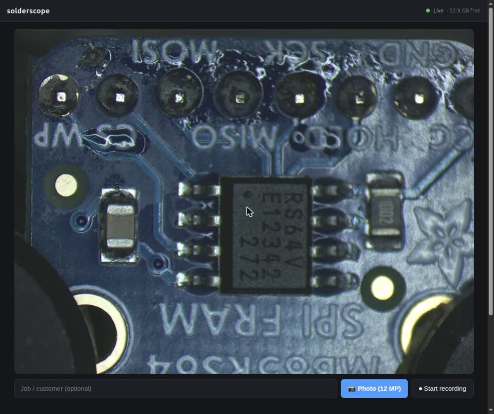
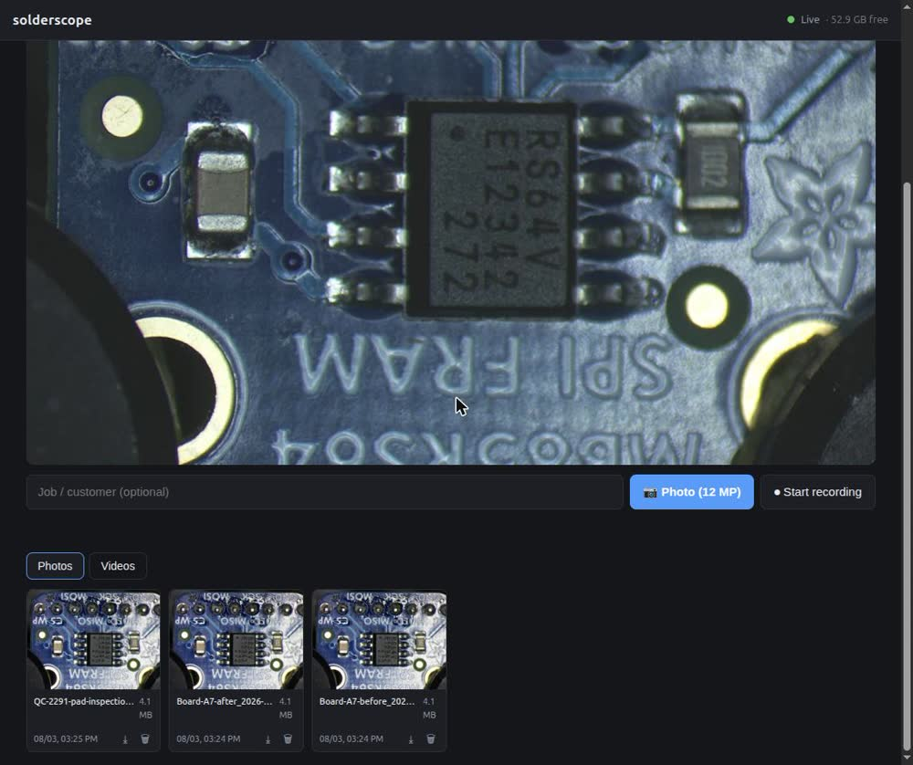
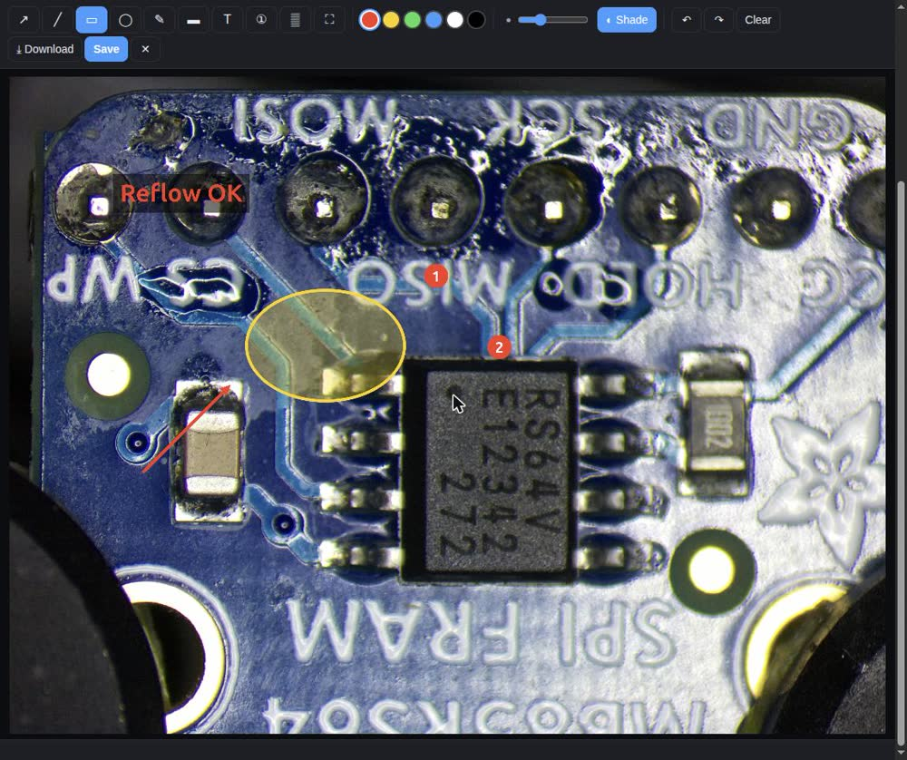
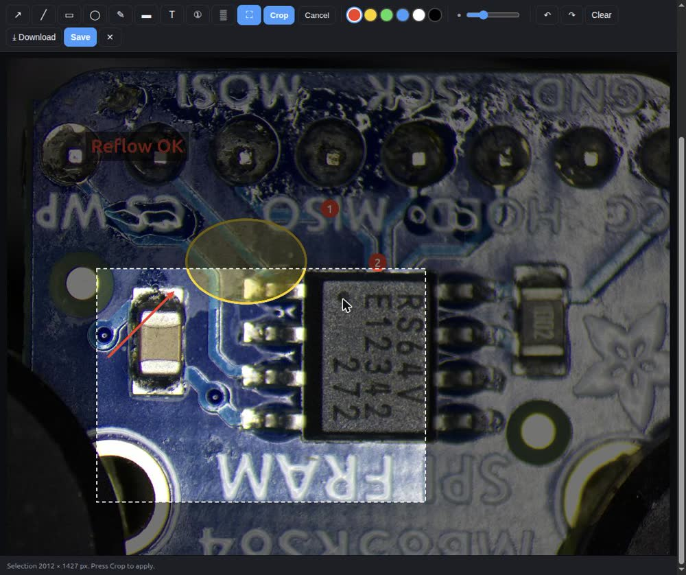
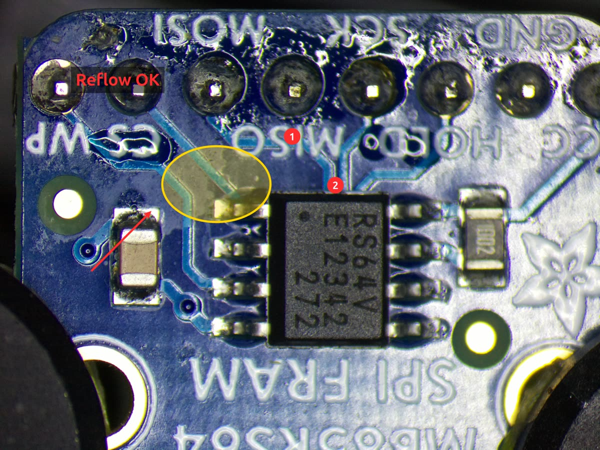

# solderscope

Camera-based documentation for a soldering microscope: a live view on any phone,
tablet or desktop, full-resolution stills, video recording, and image annotation
straight in the browser.

Built for **customer documentation and inspection**: before/after shots, defect
reports, evidence for a repair log. Deliberately *not* a live working view. The
actual work happens through the binocular; the stream is there to document it.

> [!WARNING]
> Built for a trusted workshop network. No authentication, no TLS.
> See [Access and security](#access-and-security) before deploying it anywhere.



## What it does

* **Live view** on any device on the network, no app required. WebRTC, HLS or RTSP.
* **Full-resolution stills** (12.3 MP) at the press of a button.
* **Video recording**, started and stopped from the browser, with no re-encoding
  on the Pi.
* **Annotation in the browser**: arrows, boxes, text, freehand. The original is
  never touched; annotations go into a copy.
* **Job context**: whatever you type in the job field becomes part of the filename.

## What it looks like

Every capture in one place, with size, timestamp, download and delete:



Clicking an image opens the annotation editor, here with text, an ellipse, an
arrow and numbered callouts:



Cropping down to what matters. Existing annotations move with the crop:



The finished result, as the customer receives it:



## Hardware

| Part | Used here | Notes |
|---|---|---|
| Computer | Raspberry Pi Zero 2 W | 512 MB, ~416 MB usable. A Pi 4/5 would be more comfortable but is not required |
| Camera | Raspberry Pi HQ Camera (Sony IMX477), 12.3 MP | C/CS mount, no lens |
| Microscope | SM-4TP stereo microscope, 7–45× (complete set, black) | Trinocular with photo tube, bought from eleshop |
| Camera adapter | C-mount 0.5× (clamp type), eleshop | Reduction optics. **0.35× would be the better choice**, see below |
| Enclosure | 3D printed, holds HQ Camera and Pi Zero together | Model recommendation below |
| Storage | microSD, 32 GB or larger | Recordings add up |
| OS | Raspberry Pi OS Bookworm, 64-bit | Lite is enough, no desktop needed |

> **Field of view and the adapter:** The camera sees less than your eye does
> through the eyepiece. This is not a software setting. The sensor is verifiably
> read out in full (`ScalerCrop` = 4056×3040 starting at offset 0,0). The cause
> is optical: the IMX477 is a 1/2.3" sensor with a 7.9 mm diagonal, while a photo
> tube projects an image circle of 20 to 23 mm.
>
> A C-mount adapter with reduction optics compensates for part of that. This
> build uses a **0.5×** adapter, the common default. **For a 1/2.3" sensor,
> 0.35× is the better call** and buys noticeably more field of view. Anyone
> rebuilding this should factor that in at purchase time; swapping later rarely
> justifies the price.
>
> Stronger reductions (0.25×) cost brightness and tend to darken the corners,
> because the lens no longer illuminates the whole sensor. For overview shots
> there is another way: zoom out and crop the 12 MP image afterwards. There are
> plenty of pixels to spare.

### The build

<!-- Photo of the setup: docs/screenshots/00-build.jpg -->
*(Photo of the full setup to follow.)*

The HQ Camera and the Pi Zero 2 W share a single 3D printed enclosure with a
screw-on lid.

> **On the enclosure model:** This project grew over a long stretch of time, and
> the origin of the files originally printed can no longer be traced. If you are
> rebuilding it, take the first model. Both hold the HQ Camera **and** a Pi Zero:
>
> * **[Pi Zero Webcam (HQ Camera)](https://www.printables.com/model/48519-raspberry-pi-zero-webcam-hq-camera)**
>   Recommended. An internal frame bolts the camera and the Pi down
>   *individually* instead of just sandwiching them between the shell halves.
>   That is exactly what matters when the enclosure hangs off the C-mount (see
>   "Load direction" below). Four case screws, C-mount cutout, Blender source and
>   instructions.
> * [Leonti/rpi-hq-camera-case](https://github.com/Leonti/rpi-hq-camera-case)
>   ([STLs on Thingiverse](https://www.thingiverse.com/thing:4646780)).
>   An alternative, generated from CadQuery Python and therefore parametric.

Two things to get right when printing:

* **Ventilation.** The Pi Zero 2 W runs above 60 °C under load (measured:
  64.5 °C, no throttling), so the enclosure needs openings.
* **Load direction.** Both models are designed as webcam enclosures, where the
  enclosure carries the camera. On a microscope it is the other way round: the
  camera hangs off the C-mount thread and carries the enclosure and the Pi with
  it. Check that the wall around the camera cutout can take that, and make sure
  the ribbon cable puts no strain on the CSI connector. Strain there shows up
  directly as soft focus.

## Using it

Open the web UI at **`http://<pi-host>`** (port 80, no port number needed).

* **Photo (12 MP)**: full sensor resolution, roughly 3 seconds until the image is
  saved. The stream pauses while that happens (see *Sensor handover* below) and
  comes back on its own.
* **Record**: starts and stops video recording. MediaMTX writes the running H264
  stream straight to disk without re-encoding it.
* **Job field**: the text you enter becomes part of the filename
  (`Customer-XY_2026-08-03_14-22-01.jpg`), which makes filing them easy.
* **Fullscreen**: button in the bottom right of the live view. The browser's own
  video bar is deliberately hidden, since a scrubber and a running timer are
  meaningless on a live stream.
* **Tap an image** to open the annotation editor, described below.

### Annotation editor

Modelled on [Flameshot](https://flameshot.org/). Saving writes a copy with an
`_annot` suffix; **the original is never modified**, which matters for customer
documentation. "Download" saves straight to whatever device you are holding.

| Tool | Key | |
|---|---|---|
| Arrow | `A` | |
| Line | `L` | |
| Rectangle | `R` | optionally shaded |
| Ellipse | `E` | optionally shaded |
| Freehand | `F` | |
| Marker | `M` | semi-transparent, for highlighting |
| Text | `T` | typed directly on the image, multi-line |
| Numbering | `C` | sequential callouts ① ② ③ |
| Pixelate | `P` | for serial numbers and the like |
| Crop | `K` | drag a region and confirm; annotations move with it |

Six colours, an adjustable stroke width, undo/redo (`Ctrl+Z` / `Ctrl+Y`), save
with `Ctrl+S`, close with `Esc`. All of it works by touch, for use on a tablet.

Shading a rectangle or an ellipse tints the area instead of covering it, so
whatever you are pointing at stays visible underneath. The button only appears
while one of those two tools is selected.

Stroke width and font size scale with image size, so annotations stay legible
once a 12 MP image is scaled down into a report.

The raw stream is also reachable directly:

| Protocol | Address | Notes |
|---|---|---|
| WebRTC | `http://<pi-host>:8889/cam` | lowest latency, the default |
| HLS | `http://<pi-host>:8888/cam` | robust, 2 to 5 seconds behind |
| RTSP | `rtsp://<pi-host>:8554/cam` | VLC, OBS |

Photos and recordings live on the Pi under `~/solderscope-media/`. The gallery loads
previews from `thumbs/`; the editor always opens the full 12 MP original.

## Installation

On a fresh Pi, once, run this on the Pi itself:

```bash
./scripts/bootstrap-pi.sh
```

To deploy or update the application, from your workstation:

```bash
./scripts/deploy.sh <user>@<pi-host>
```

To update MediaMTX (validates the config first, rolls back on failure):

```bash
./scripts/update-mediamtx.sh
```

## Why it is built this way

### Sensor handover

The camera is **exclusive**. While MediaMTX holds the sensor, any second attempt
to use the camera fails:

```
ERROR: failed to acquire camera: Pipeline handler in use by another process
```

A full-resolution still is therefore only possible if MediaMTX steps aside. The
capture service stops MediaMTX, takes the shot, and starts it again. A
`try/finally` guarantees the stream returns even when the capture fails, and a
lock keeps two concurrent captures from tripping over each other.

The response comes back in about **3 seconds**. Measured breakdown of the
original 14-second round trip:

| Phase | Before | Now |
|---|---|---|
| Stop MediaMTX | 0.2 s | 0.2 s |
| Settle time after the stop | 2.0 s | 0.3 s |
| Capture (`rpicam-still`) | 3.7 s | 1.9 s |
| Start MediaMTX | 0.3 s | 0.3 s |
| Wait for the stream to return | 8.5 s | moved off the critical path |

Two thirds of the time went into waiting for the stream, long after the image had
been written. That now happens in the background. The lock is only released once
MediaMTX is serving again, so a second capture cannot run into a half-started
service.

The warm-up time for `rpicam-still` dropped from 1500 ms to 500 ms because the
microscope light is constant: mean image brightness was identical (106.7) at
anything from 300 to 1500 ms.

The trade-off is acceptable here precisely because the work happens through the
binocular and the stream is documentation only.

### Sensor mode: 2028×1520 instead of 4056×3040

The stream originally ran with `rpiCameraMode: "4056:3040:12:P"`, reading the
full sensor and scaling it down to 1440×1080 afterwards.

That produced **constant frame drops**: 49 `VIDIOC_QBUF failed` per minute. The
cause was not a shortage of memory but **CMA fragmentation**. The kernel said:

```
cma: alloc failed, req-size: 4537 pages, ret: -16 (EBUSY)
number of available pages: … => 17671 free of 65536 total pages
```

Plenty of free pages, but the largest contiguous block was too small for the
18.5 MB a 12 MP buffer needs in one piece.

The binned mode `2028:1520:12:P` needs only 4.6 MB per buffer:

| | Before | After |
|---|---|---|
| QBUF errors | 49 per 60 s | ~0 |
| CmaFree | 22 MB | ~83 MB |

**Stream quality does not suffer.** It is scaled to 1440×1080 either way, and
2028×1520 is still above that. The old setting read sensor data only to throw it
away. Stills still use the full 4056×3040, because MediaMTX is paused for those
and the CMA pool is free.

### No measurement tool

Left out on purpose. The microscope's zoom is **continuous**. Without repeatable
detents there is no reliable scale (px/mm) to calibrate against: every change in
zoom would invalidate the calibration silently, without the software noticing.
Wrong millimetre figures in a customer report are worse than none at all.

Annotations are unaffected by this and are therefore implemented: they need no
scale.

## Layout

```
config/
  mediamtx.yml         streaming config (reference copy of /etc/mediamtx.yml)
  50-solderscope.rules    polkit rule scoped to one unit, for the sensor handover
service/
  solderscope.py          capture service: stills, recording control, web server
  solderscope.service     systemd unit
web/
  index.html app.js style.css    web UI including the annotation editor
scripts/
  bootstrap-pi.sh      first-time setup of a fresh Pi
  deploy.sh            deploy and update the application
  update-mediamtx.sh   MediaMTX update with config validation and rollback
docs/
  findings.md          measurements and diagnosis in detail
  screenshots/         images for this README
```

## Operational notes

* **Stay on Bookworm.** Trixie has an open sensor-mode bug on exactly this
  hardware (Zero 2 W + IMX477):
  [picamera2#1358](https://github.com/raspberrypi/picamera2/issues/1358).
* **`recordDeleteAfter` is set to `0s`** (never delete). The MediaMTX default is
  `1d`, which would have removed customer documentation after a day. Keep an eye
  on disk space instead; the web UI shows it.
* Plan a **reboot** after an `apt upgrade`. It also clears the fragmented CMA
  pool as a side effect.
* White balance is set to `indoor` (automatic). A fixed value would be better for
  colour-comparable before/after shots. Not implemented yet.

## Access and security

> [!WARNING]
> **This is a workshop tool, not a hardened product.** It is written for a
> trusted, restricted network and nothing else. Do not expose it to the internet,
> do not port-forward it, and do not run it on a network you do not control.
>
> Concretely, and by design:
>
> * **No authentication and no authorisation.** Anyone who can reach the port can
>   view the stream, trigger captures, start recordings and delete files.
> * **No transport encryption.** Plain HTTP, plain RTSP. Everything is readable on
>   the wire.
> * **No rate limiting, no CSRF protection, no audit log.**
>
> If you need remote access, put it behind a VPN, or behind a reverse proxy that
> terminates TLS and enforces authentication. Do not rely on the application for
> either.

Within those limits, the design keeps privileges as small as it can.

**No sudo.** The capture service has to stop and start MediaMTX to get at the
sensor, and it does that through polkit rather than a sudoers entry:

```javascript
// config/50-solderscope.rules
if (action.id == "org.freedesktop.systemd1.manage-units" &&
    action.lookup("unit") == "mediamtx.service" &&
    subject.user == "master" && !subject.remote) {
    return polkit.Result.YES;
}
```

One user, one unit, local sessions only. `systemctl` then talks to systemd over
D-Bus with exactly the privilege it needs, and no setuid binary is involved.
Verified on the target: stopping `ssh`, `cron` or the service's own unit is
still refused.

**No root.** The service listens on port 80 as an unprivileged user, because
systemd hands it a single capability:

```ini
AmbientCapabilities=CAP_NET_BIND_SERVICE
```

`CapabilityBoundingSet` is intentionally left alone. Restricting it to that one
capability looks tidier, but it was tested on the target and it breaks the
sensor handover: MediaMTX can no longer be stopped, and every capture fails with
`Pipeline handler in use by another process`. The failure mode is easy to
misread, because the web UI keeps working while only photos are broken.

## On AI

Parts of this implementation were built with AI assistance (Claude Code): mainly
the capture service, the web UI and the deployment scripts.

I mention that not as a disclaimer but because it is part of the story. AI is an
everyday tool for me, in the same way an oscilloscope or a soldering station is.
My time is tight, and projects like this one happen in the gaps between the work
that pays. Without that tool solderscope would have stayed a script that barely
manages to save an image, instead of becoming something I use daily and am happy
to publish.

What the tool does not replace is judgement. The concept, the requirements and
every engineering decision are mine. The diagnosis in
[`docs/findings.md`](docs/findings.md) rests on measurements taken on the real
device: the error rates, buffer sizes and comparisons quoted there are
reproduced measurements, not estimates. Code and documentation have been reviewed
and tested on the target hardware.

## Licence

MIT, see [LICENSE](LICENSE).

---

Built by [embedded-arts.de](https://embedded-arts.de), embedded engineering from
architecture to production-ready Linux. This tool came off my own bench, because
nothing else fit.
